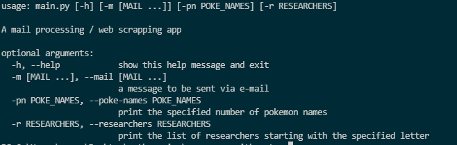

# Python playground

A collection of small apps written to get to know the language and its features.

---

### argparser-with-smtp

Has command-line arguments parsing capability, also you can send someone an email using the configuration in the directory (+ other options, including an API test)

### excel-reporting-app

Takes a CSV file with data as an input and produces an Excel report with important facts based on that, here - airplane crashes over time.

### gui-app-api-database

A nice little Tkinter app for manipulating an SQLite database. Loads data from the internet.

### logs-analysis

Analyzes a web server log file, parsing all entries into objects and returning some clever output.

### simple-unit-tests

Experimenting with the Pytest library.
